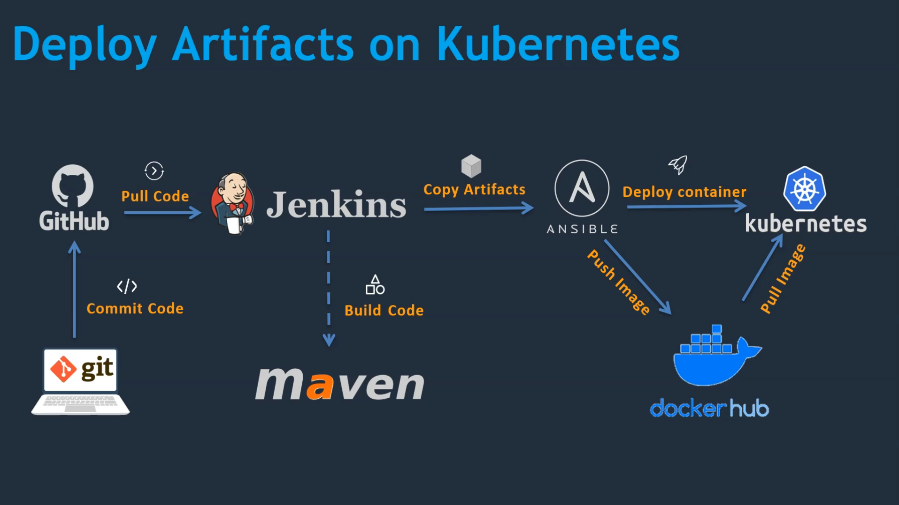

# Devops Project Overview

## Setup CI/CD with Github, Jenkins, Maven and Tomcat

- Setup Jenkins
- Setup & configure Maven and Git
- Setup Tomcat Server
- Integrate Github, Maven, Tomcat Server with Jenkins
- Create a CI and CD job
- Test the deployment

## Setup CI/CD with Github, Jenkins, Maven Ansible and Docker

- Setup Ansible Server
- Integrate Docker host with Ansible
- Ansible playbook to create container
- Integrate Ansible with jenkins
- CI/CD job to build code on ansible and deploy it on docker container

## Deploy Artifacts on Kubernetes

- Setup Kubernetes (EKS)
- Write pod, service and deployment manifest files
- Integrate Kubernetes with Ansible
- Ansible playbooks to create deployment and service
- CI/CD job to build code on ansible and deploy it on Kubernetes